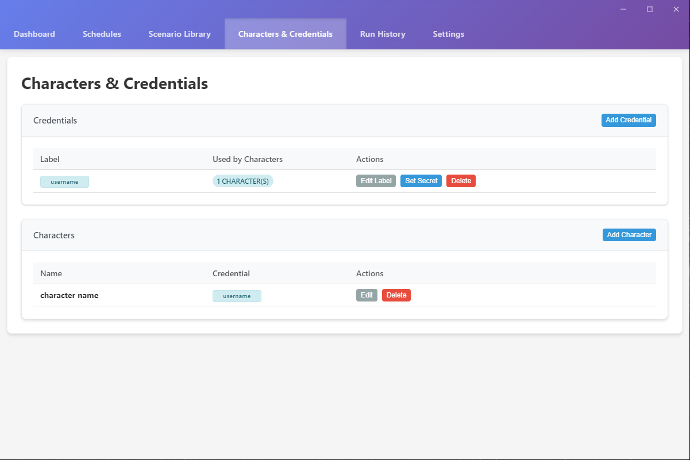
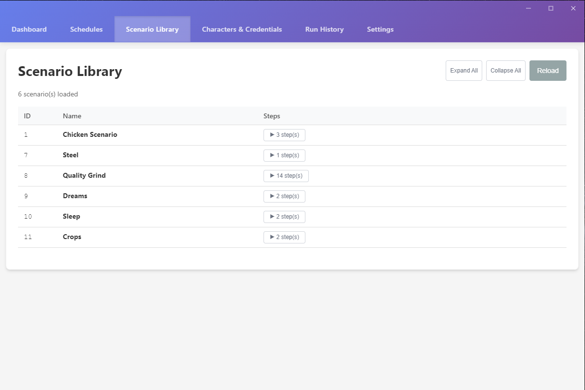
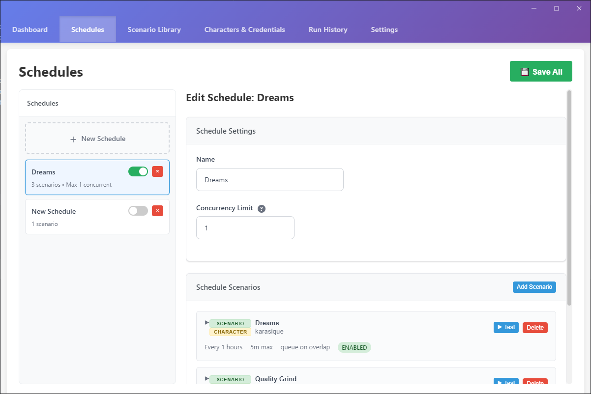
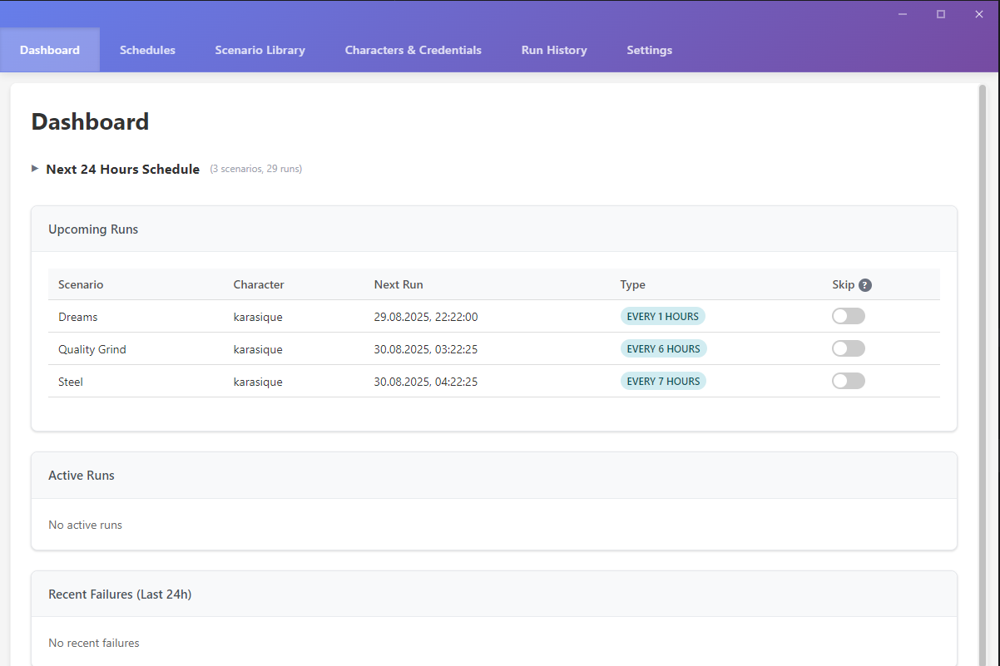
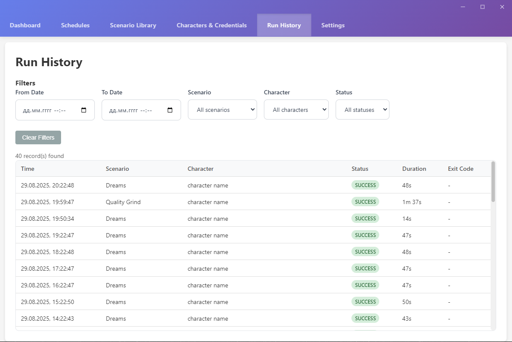

# HnH Scheduler - Getting Started Guide

Welcome to **HnH Scheduler**! This application automates running Haven and Hearth scenarios on a schedule using the Nurgling client. This guide will walk you through everything you need to know to get started.

## What is HnH Scheduler?

HnH Scheduler is a desktop application that:
- Automatically runs your Haven and Hearth scenarios at scheduled times
- Works with existing Nurgling scenarios (no need to recreate them)
- Manages multiple characters and login credentials securely
- Provides detailed logging and run history
- Runs completely offline with no external servers

## Prerequisites

Before using HnH Scheduler, you need:

1. **Java Runtime Environment (JRE) 21 (recommended)**
2. **Nurgling client** (hafen.jar) 
3. **Existing scenarios** created in Nurgling (stored as `scenarios.nurgling.json`)

## First Time Setup

### Step 1: Configure Game Settings

Click on the **Settings** tab and configure your game paths:

1. **Java Path**: Enter `java` if Java is in your system PATH, or browse to your Java executable
2. **Hafen JAR Path**: Browse to your `hafen.jar` file (your Nurgling client)
3. **Java Version**: Check "Java 18+" if you're using Java 18 or newer

### Step 2: Add Your Characters and Credentials

Navigate to the **Characters & Credentials** tab:

#### Adding Credentials
1. Click **Add Credential**
2. Enter a label (e.g., "username", this is just a visual representation to avoid revealing actual username)
3. Enter the Username and Password
4. Click **Create**

#### Adding Characters  
1. Click **Add Character**
2. Enter your character name
3. Select the credential to use for this character (which account this character is on)

**Important**: Your passwords are stored securely in your system's keychain and never displayed in the application.

## Understanding Scenarios

The **Scenario Library** shows all scenarios from your `scenarios.nurgling.json` file:
- Scenarios are automatically loaded from `%APPDATA%/Haven and Hearth/scenarios.nurgling.json`
- You can click **Expand All** to see detailed steps for each scenario
- Use **Reload** if you've updated scenarios in Nurgling

**Note**: You create and edit scenarios in the Nurgling client itself, not in HnH Scheduler.

## Creating Schedules

The **Schedules** tab is where you automate your scenarios:

### Creating a New Schedule
1. Click **New Schedule** in the left panel
2. Give your schedule a name
3. Set the **Concurrency Limit** (how many scenarios can run simultaneously)
4. Click **Add Scenario** to add scenarios to this schedule

### Adding Scenarios to a Schedule
For each scenario you add:
- **Scenario**: Select from your available scenarios
- **Character**: Choose which character will run this scenario
- **Timing**: Choose from:
  - **Interval**: Run every X minutes/hours
  - **Cron**: Use cron syntax for complex scheduling (e.g., "0 */6 * * *" for every 6 hours)
  - **Once**: Run once at a specific date/time
- **Max Duration**: Maximum time to let the scenario run before stopping it
- **Overlap Policy**: What to do if the scenario is still running when the next execution time arrives:
  - **Skip**: Skip the new run
  - **Queue**: Wait for current run to finish, then start
  - **Kill Previous**: Stop the current run and start new one

### Enable/Disable Schedules
- Toggle the switch next to each schedule name to enable/disable it
- Only enabled schedules will run automatically

Don't forget to click **💾 Save All** when you're done making changes!

## Monitoring Your Automation

The **Dashboard** provides real-time information:

### Next 24 Hours Schedule
See all upcoming scenario runs in a calendar view.

### Upcoming Runs
Shows the next scenarios scheduled to run in chronological order.

- When they'll run next
- Which character will execute them
- The schedule type (Every X hours, cron, etc.)
- Skip toggle to temporarily skip specific runs

### Active Runs
Displays scenarios currently running, if any.

### Recent Failures
Shows scenarios that failed to run in the last 24 hours for troubleshooting.

## Run History and Troubleshooting

The **Run History** tab shows detailed logs of all scenario executions:

### Viewing History
- **Filter by date range**: Set "From Date" and "To Date"
- **Filter by scenario**: Select specific scenarios
- **Filter by character**: See runs for specific characters
- **Filter by status**: View only successes, failures, etc.

### Understanding Status Codes
- **SUCCESS**: Scenario completed normally
- **FAILED**: Scenario encountered an error
- **TIMEOUT**: Scenario exceeded its maximum duration
- **KILLED**: Scenario was manually stopped

### Duration Column
Shows how long each scenario run took to complete.

## Best Practices

### Schedule Planning
- **Start small**: Begin with one or two scenarios to test your setup
- **Avoid conflicts**: Don't schedule scenarios too close together for the same character
- **Set realistic timeouts**: Give scenarios enough time to complete normally
- **Use appropriate overlap policies**: "Skip" is safest for most scenarios

### Resource Management
- **Monitor concurrency**: Don't run too many scenarios simultaneously
- **Check system resources**: Ensure your computer can handle multiple Haven & Hearth clients

### Troubleshooting
1. **Scenarios not starting**: Check Settings for correct Java and Hafen paths
2. **Login failures**: Verify credentials in Characters & Credentials
3. **Scenarios timing out**: Increase max duration or check for stuck scenarios
4. **Java errors**: Ensure correct Java version setting

## Security Notes

- **Credentials are encrypted**: Passwords are stored securely in your system keychain
- **Local operation**: No data is sent to external servers
- **Access control**: Only you can access your stored credentials

## Tips for Success

1. **Test manually first**: Run scenarios manually in Nurgling before scheduling them
2. **Start with longer intervals**: Begin with hourly or daily schedules, then optimize
3. **Monitor initially**: Watch the first few runs to ensure everything works correctly
5. **Update carefully**: Test schedule changes with a few runs before leaving unattended

## Getting Help

If you encounter issues:
1. Check the **Run History** for error details
2. Verify your **Settings** configuration
3. Test scenarios manually in Nurgling client first
4. Check that Java and Haven & Hearth are working independently

---

**Happy automation!**